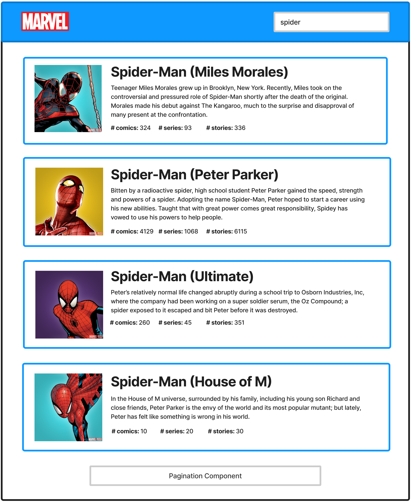

### Description

The idea is to create a simple frontend application that retrieves data from a server and renders a list of entities. Using Marvel's API in order to list the different superheroes and supervillains, and the user needs to allow the user to search for a character based on their name. The main page should:

- On start up, show an empty page with no results
- When the user searches for a superhero, by typing on the Search field, and hits enter, a list of 4 results will be displayed. The results displayed should display superheros where their name starts with the text entered by the user on the Search field.
- At the bottom of the page, if there are more results, a simple pagination system will be displayed, that will allow the user to see more results and there is also a Pagination component.

- Character's image
- Character's name
- Character's description
- Character's total amount of comics, series and stories where it appears.

### Acceptance criteria

For this test to be completed, the user's application should:

- Allow the user to search for marvel characters by their name
- Display a list of 4 results, each of them with an image, title, description and amount of comics, series and stories
- A pagination component that allows the user to navigate between pages.

## Stack

In this test, we encourage the user to use the technologies that we use in our daily basis:

We can use design : [https://github.com/lumapps/design-system](https://github.com/lumapps/design-system). This is an open source library created by LumApps and that we use in our current product. The user can access the library's documentation by going to https://design.lumapps.com/.

For the API that the user will be using, the user will need to consume Marvel's Open API to retrieve the different characters and their information. The user can take a look at the API and how to use it here:  
[https://developer.marvel.com/docs](https://developer.marvel.com/docs)

The user will need an API key in order to execute these requests. Please use the following one:  
`8fb61ed0d8ae4cc76943c8d2b8e2ed9c`

In order to use this API key, the user has to edit their `/etc/hosts` file, adding this line `127.0.0.1   develop.lumapps.com`.

## Setup

We should fork the repo and create their own, downloading it locally.

In the project directory, the user needs to run: `yarn`
This will setup the necessary dependencies to execute this project.

Need to use Node JS v.14 in order to run this project. Not doing so will result in an error. The user can install this particular version using [nvm](https://github.com/nvm-sh/nvm).

To start development, the user can execute `yarn start`, which will run the app in development mode.
